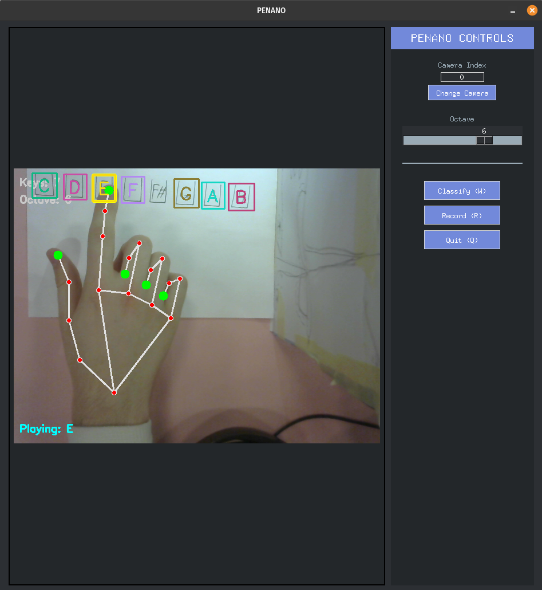
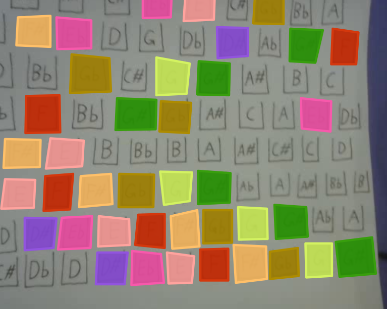
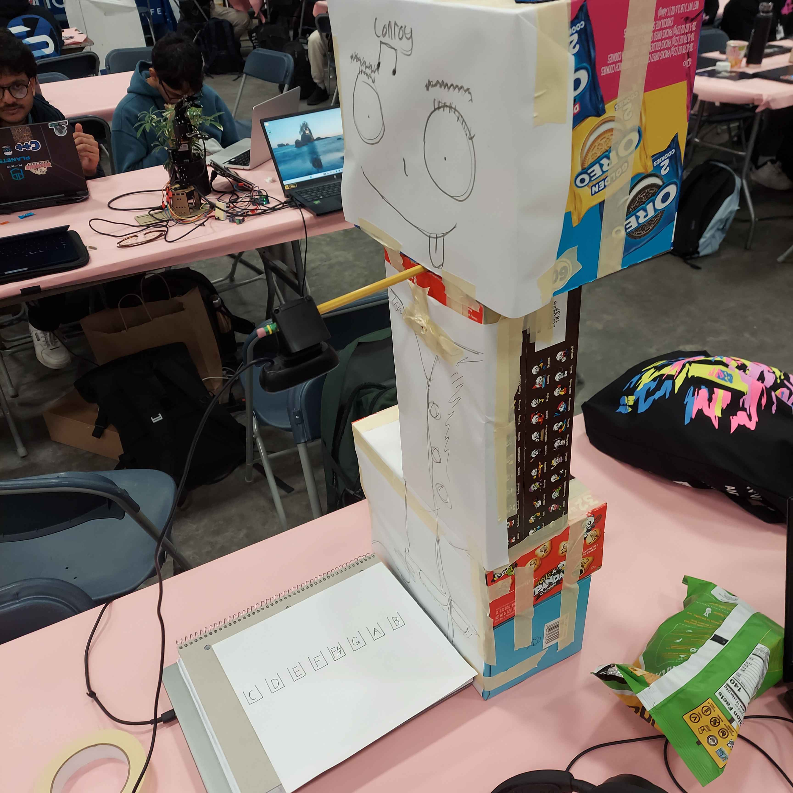

PENANO 🎹✋🎶

PENANO is a virtual piano controlled by your hands.
Using MediaPipe hand tracking, YOLO object detection, and a real-time audio engine, it lets you play piano notes by moving your fingers in front of a camera.
You can also record your playing, save it as MP3, and generate music using Suno AI’s API based off the notes you played.

✨ Features

🎵 Real-time piano synthesis with harmonics and envelopes

✋ Hand tracking with MediaPipe to detect fingertips

🟥 YOLO-based key detection – map rectangles in the video feed to piano notes

🎧 Audio recording (saves as MP3 via pydub)

🎼 Octave control (adjust from GUI scrollbar)

⌨️ Hotkeys:

W → Detect piano keys

R → Start/stop recording

Q → Quit and save

🤖 Suno AI integration – generate AI-composed music from detected notes

